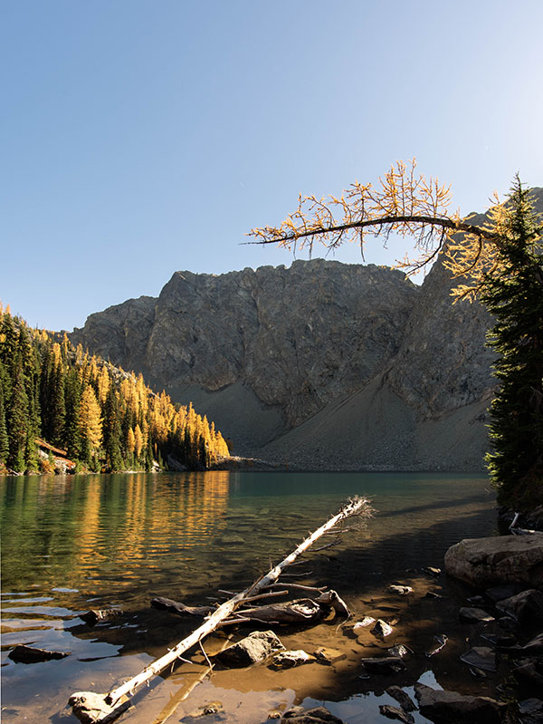
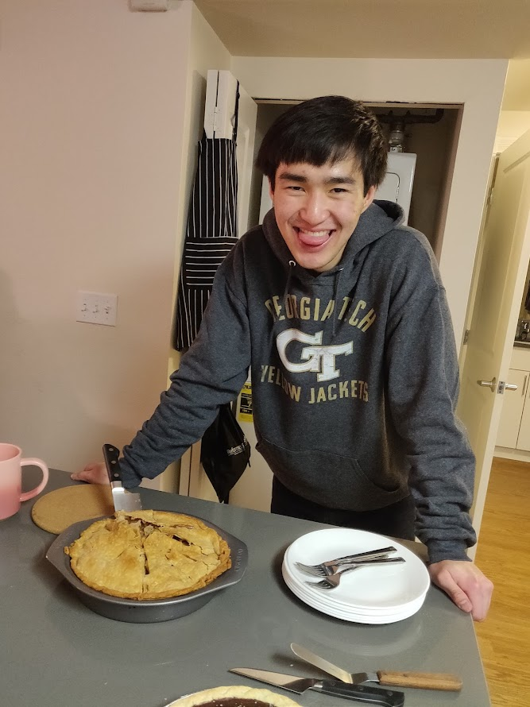

_Cards from friends from my community group to welcome me back!_

Originally I wanted to write up a quick sharing a month into my move across the continent, but things got a bit overwhelming, and then one month turned into two, two turned into three... And now Christmas is over! I was actually hoping to finish my article on preaching earlier in the year, but it's looking like that will be delayed until early next year (hopefully no more delays 😤) — it's quite the heavy article, so pray for me for this 🙏 (put another way, I'm procrastinating writing by writing something completely different 😅). I also didn't want to take away from the Advent season by writing something not related to Advent, so I was having some second thoughts on writing this... But God has been at work in very funny and joyful ways this season that I couldn't NOT share!

# My First Week in Seattle

Looking back, I had such the huge privilege, taking an effective four month break before starting up work. I spent so much of that time with family, with the church I started attending in Mississauga (and helping my parents get more connected as well), and catching up with friends that I haven't seen in a very long time. While I didn't run around and do the typical grad trip, I'm kinda glad my summer played out the way it did, being able to rest and relax especially after a very long journey through undergrad.

As I looked towards moving to Seattle, I juggled SO many things, like finding an apartment, furniture and other home items, packing and shipping my kitchen things and books (well, in part; a lot still remains in Canada 🤣), and filling out church membership forms. I thought it was gonna be straight forward, and so I tried to do most of this in the last two weeks... Let's just say that I've learned that some websites are geo-restricted, and if you want to purchase things outside of their country, you'll have to setup a VPN (thankfully this wasn't too hard, just annoying).

My first week in Seattle was WILD. Actually, never mind first week, my first 48 hours was SO chaotic, but that's because I was trying to have the essentials come together by the time I needed to move in (which would be the third day). So here's the play-by-play: I land in Seattle on a Saturday evening, and I immediately got a ride from the airport (thank you brother David), and then went out for dinner to catch up with him and another brother (and had my dinner paid for, thank you Jerry)! Then Sunday hits, and I'm obviously at church, but totally mix up the start time, so I walk in 30 minutes late (oops...). But it was such a joy seeing pretty much everyone I knew from my last time in Seattle, and also getting to know so many other folks that recently joined the church! That afternoon, I had scheduled to pick up a dining set (a very nice one off Facebook marketplace, mind you) that was a 45 minute drive out east. I went to grab a rental van and just started driving... Thankfully, I had a huge help from another brother from church (though it was my first time meeting him that Sunday, LOL — thank you for risking your life with essentially a stranger as I drove this clunky van down the highway, brother Kevin)! That table was super tough to move around since it technically can seat eight 🤣 — shout out sisters Joanna and Steph for meeting at my apartment to help us move this table in, we wouldn't have survived otherwise 💀. That evening, I also had my sofa bed delivered (another purchase off Facebook marketplace, and it was in pristine condition), and the folks who sold me the sofa bed were super awesome, offering delivery for such a cheap price and being great folks to chat with as well! And that was just one day.

On Monday, I committed to getting more essentials for my apartment, so I headed to one of the department stores in downtown Seattle and amassed a LOT of various supplies. It took a backpack, two bags clipped to my backpack, another huge shopping bag slung over one of my shoulders, and my two hands to carry the other miscellaneous bulky things. I became a walking mini-department store, waddling around like a penguin 🐧🤣. It was so hard to get around, that I had to stop and pause my waddling every minute — thankfully, public transit exists! ... Though, I unfortunately took the wrong bus line and ended up having to just hail a ride back home 😭. After finally getting home and quickly unpacking, I had to make a mad dash to the church to do my members interview (yes, I did it two days after landing in Seattle). This was probably the highlight of my day, being able to finally sit down and just relax and chat. You see, up until that point, all I had was some fruit for breakfast, and I was running about and so exhausted physically, so being able to have some snacks and talk with one of the pastors was genuinely so encouraging! Funny enough, I was debating on doing my interview on the Wednesday, but something inside of me told me to do it on Monday — turns out, the elders meet on Tuesday regularly, and they actually talked about my application in time to get it processed for the next member's meeting (which happened the Sunday afterwards). Now I'm known as the guy who speed-ran church membership 🤣. Anyways, after my interview, I decided to do my whole shopping spree all over again, but this time, with groceries! And yes, I just hailed a ride back home again, since I bought WAY too much food (this seems to be a trend with me...). I finally got back that evening to be able to cook my first meal!! However, I realized that my sofa also needed to come together that very night, as I otherwise wouldn't have a bed to sleep in... I tried to assemble it on my own and... well I'm glad that I had brother David come in clutch to help me out 😅. It was a super tiring day, but I was glad that things were coming together so quickly 🙂.

_My first meal! Chicken and roasted broccoli pasta. I didn't have any dinnerware so I ate this out of the skillet with chopsticks 🥢_

Now throughout the rest of the week, my packages (primarily kitchen stuff) started to arrive. As I was cleaning things one day, my curiosity got the best of me. You see, my cutting board just so happened to fit perfectly in my sink. Being the silly person I am, I decided to purposefully drop it and see what would happen... What followed was a solid 3 minutes of panicking as I tried to pry my cutting board out from the sink to no avail 💀 — at this point, I was mentally preparing myself to lose the rest of the day to this disaster... BUT I noticed that the previous tenant just so happened to leave this metal spatula in the dishwasher. So, being the genius engineer I am, I tried to pry the cutting board with this magical spatula — and I was able to free the cutting board! God provides in very odd and funny ways I guess 🤣 (but I've also had to use this spatula on more than one occasion... 😶).

To round off the week, I was got some help from Steph on Friday to do a quick Ikea trip! We got my bed frame and then proceeded to assemble it. It definitely was a bit finicky to put together, but I'm glad that I could finally sleep in a proper bed (thank you once again sister Steph 🙏)!

# Settling in Seattle

The remainder of the first month went by so quickly as I continued to put my life together and get some other mini furniture together. At the end of the month, I decided to finally host my housewarming party! It was such a joy to see my apartment filled to the brim with many friends feasting together (I had nearly 20 people in my one bedroom apartment at a time, with roughly 25 people coming out in total)! I'm so glad for community 😁.

_Here's what I made that night! Kofte over rice, with hummus and a salad, topped with a garlic-yoghurt sauce (for some reason I instinctively spell yogurt with a "h" even though all the Canadian friends I know of look at me oddly and prefer the spelling without the "h")._

_A quick snapshot of friends eating together — this was barely half the people that came out that night!_

_What 10 cups look like. For some reason I thought that people would eat lots of rice so 10 sounded right... I in my twisted mind started chuckling when I saw this sight (it's definitely one to behold), but I definitely had to eat a bunch of rice dishes the remainder of the next week 🤣_

Later in October, some friends from church organized a hike right as the trees were turning colours (in Washington, we've got pine trees that have their needles turn bright yellow and then drop for the winter, which is quite unique)! This was such a wonderful hike as the weather was fantastic! Throughout the hike, I found myself talking to folks that I knew previously, but never had any lengthy conversations with. This was the first time since coming back that I felt this close and familiar with everyone, as if there wasn't such a huge time gap, and for that, I'm glad 😊.

_Da bois 😎_

_On the trail 🚶‍♂️🚶‍♀️_

_Blue Lake w/ Larches!_

_Bird! 🐦_

In November, I ended up hosting another large group — worship night! We ate lots and sang lots more 🎶.

And to round out November, I attended numerous Thanksgiving/"friendsgiving" gatherings (now that I'm writing this it might be time to invest into a scale to make sure I'm not gaining unnecessary weight 🤣)!

_Friendsgiving no. 1 — shout-out Sam for carving the turkey!_

_Singing praises and thanks to God together!_

_Such a large group and space, but it was super awesome to see everyone (and all the various delicious foods)!_

_Thanksgiving day with my community group!_

Oh I guess I also went to Discovery park, with all my camera gear... But totally forgot to bring batteries so I was just carrying around expensive glass and metal around for fun 💀 But still managed to get some good shots on my phone!

_I waited for the right time for the boat to pass by the two lines reflecting the sun's rays in the water 🤩_

And of course, December was filled with more gatherings! Christmas carolling, and eating more good food 😋!

_The first large gathering in December for carolling and dinner!_

_I hosted a more intimate/smaller group for Christmas day! Providing company to those who didn't have any 😊_

_Shout-out Kevin for making apple by FROM SCRATCH! 👨‍🍳👏_

_We also had my chocolate tart for dessert — I was definitely so full I kinda zoned-out during our discussions oops_

I'm honestly so glad for how quickly I reconnected with everyone! It feels like a home away from home, like a comforting closeness feeling 😊.

# Work Updates

I've been asked this a good amount, and I think it's worth sharing. I got put on a team that was not the same as my internship, and looking back, it truly is God's provision! My current team is super awesome, having a wonderful manager who is super ambitious and wants the team members to take an active role in their growth (we met prior to me starting work, and she immediately dropped the fact that she already had a series of projects to get me promoted as soon as possible — where do you find a manager like that??). Not only that, but my teammates have been super helpful. I'm working in quite a complex domain, and being able to hit them up whenever has helped me settle into the team. And above all, the operations load isn't as stressful, so our team gets the benefits of doing exciting and complicated work, without the major stress! I'd like to think we have decent work-life balance 🤣. So honestly, I'm super glad for the work I get to do!

# Reflecting on My Recent Spiritual Walk

Thinking back to when I was still in Canada, I was in a "spiritual slump", as I didn't have many responsibilities, so my discipline went out the window 😬... It also didn't help as I didn't have as tight-knit of a community back home in Mississauga, as I haven't spent a lot of time investing and building relationships. While I did meet wonderful brothers and sisters in the faith, I just wasn't able to build those up. I wish I could say that things turned around before I left for Seattle, but knowing that I only had two months left (at the time of receiving my offer letter in June) sorta killed my motivation 🙃.

Now being back at my church in Seattle has been encouraging, but I still was lacking super deep relationships, since the most I'd know people for was four months (which still is significant)... So I knew I just had to start things up ASAP. I'm very glad for the past 2.5 months of my discipleship group (DG), as we've had the shared sweetness of studying the Scriptures together, singing songs, memorizing Scripture, and confessing sins. It's been super edifying and I could see my fellow brothers also grow in their sanctification! As much as I like taking breaks, I also can't wait to see everyone again in the new year to get back into the swing of things!

## Wrestling with Belonging to a Church

Becoming a member at my church has been quite interesting. It's one thing to sign a paper and share the same confessions, but it's another thing to belong to a group of believers and use your talents to encourage the body and build the church. And being super new, it's a bit difficult to do that (rightfully so). Trying to find places where I can serve and best use my talents and experience has been tough.

There are also times that I find myself wanting more depth to be preached from the pulpit (oh how I miss the pulpit from Trinity Bible Chapel in Waterloo 😭), or other minor disagreements on practice (e.g., musical worship, the Lord's Supper, etc.). I've had to really watch and humble myself, and instead of being hyper critical of these minor things, to continue to pray that the local church would be sanctified and invest into others. It's one thing to have godly convictions, but if that isn't shared by others, you're just a blabbering mouth! And I'm slowly realizing this (through various discussions and even random encounters I've had) — there's a relational aspect to ministry. I'm still trying to figure out how I can best practice this, but I know that there will be lots of opportunities down the line, and I just need to continue to lean in and seek the good of others within the body!

It's been challenging and a head-scratcher, but it's been good for me to realize this.

## Fishing in the SEA 🎣

As I lean into this new phase of life, my friends have been asking me how things have been — to which I respond, "It's not necessarily a better life; it's just a different life." Sure there is lots of freedom compared to university (and even more so); life isn't as black-and-white; you could pick one of many things to do and pursue and it will _probably_ turn out well!

It's been very testing of me, to wrestle through this "limbo phase"; if you know me, you know that my ambition can go pretty far into numerous future phases of life (to the point where, yes, I've even finished some books on preaching and family worship, because I'm "preparing" 🤣). But when things don't go as I plan, I get frustrated and lose my patience... And this has been super hard to wrestle with (I'm glad to have shared these burdens with my DG)! I really don't know how things are going to play out, and I think that's okay — I just have to learn to sit with it.

What I've been reminded of is the fact that I'm in a super fortunate position, in numerous aspects. Two in particular are the freedom of time and space I have! I could very easily on a whim, decide to host upwards of 20 people in my apartment and reserve a few hours to prep and cook for them all! And it's always such a joy to do so 😁. But even more so, I'm reminded of the potential for the gospel to spread! And having the time and space to do so makes it so much easier, being able to invite friends over to share a meal and have chats. A friend reminded me of this — that the space I have would be an "outpost" for the gospel, just as our church is (slowly) moving to our permanent building that it would also be an outpost for the gospel in the city!

So I'm excited for this! I guess this is what Jesus meant by "seeking first the kingdom of God" in His sermon on the mount ([Matt. 6:25-34](https://www.biblegateway.com/passage/?search=Matthew%206%3A25-34&version=ESV)).

1/153 (for those who know 😉).

# Final Thoughts & How You Can Pray for Me!

Man, it's been good. God is SO good! And I hope that I could get across to you how good He has been to me, and as a result, join me in praising Him!

Pray that I would find my proper footing in the church, using my talents as best as I can, and that the gospel would spread among my friends who are also here in Seattle! And all the while, pray that I would lean into the LORD and trust in His gracious and generous provision every step of the way(as He evidently already has)! And above all, that I would continue to know and love the LORD all the more!
